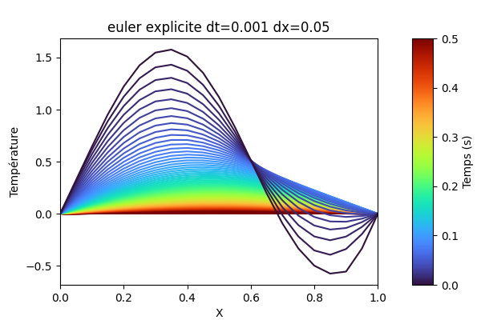
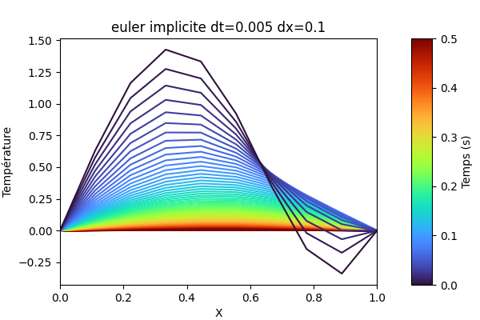
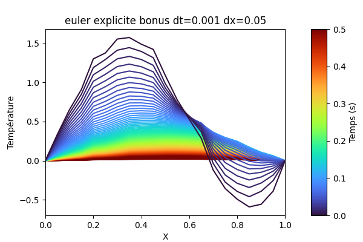
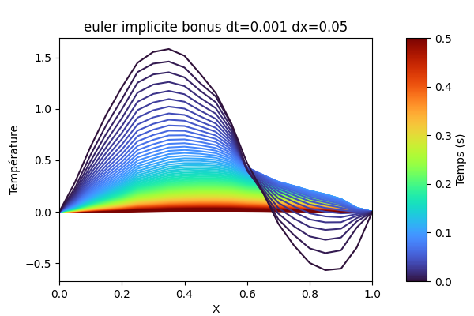

# Project C++ - Équation de la chaleur

```bash
mkdir build/
cd build/
cmake ..
cmake --build .
./src/mines-cpp-chaleur
```

## Question 2

Dans la racine du projet:

```bash
python3 graph.py build/euler_explicite.txt
```



## Question 4

```bash
python3 graph.py build/euler_implicite.txt
```


## Question Bonus 1

```bash
python3 graph.py build/euler_explicite_bonus.txt
```


```bash
python3 graph.py build/euler_implicite_bonus.txt
```



## Question Bonus 2

```
--- Performance avec dx=0.1 et dt=0.005
Euler explicite: 0.9 ms
Euler implicite: 1.7 ms
--- Performance avec dx=0.05 et dt=0.00125
Euler explicite: 12.1 ms
Euler implicite: 19.5 ms
--- Performance avec dx=0.04 et dt=0.0008
Euler explicite: 28.3 ms
Euler implicite: 44.7 ms
--- Performance avec dx=0.03 et dt=0.00045
Euler explicite: 83.7 ms
Euler implicite: 130 ms
--- Performance avec dx=0.02 et dt=0.0002
Euler explicite: 417.6 ms
Euler implicite: 642.3 ms
--- Performance avec dx=0.01 et dt=5e-05
Euler explicite: 6462.5 ms
Euler implicite: 9733.9 ms
```

## Question Bonus 3

## Tests
Dans le build:
```
./tests/mines-cpp-chaleur_tests
```

# Notes

## Pratiques

- Le code (noms de variables, classes, fichiers) est en anglais. Les commentaires sont en français.
- La documentation pour une fonction est au dessus des déclarations dans les fichiers `.h`, ou s'ils n'existent pas dans le `.cpp` directement.
- L'indexation des matrices commence à 0.
- La librairie externe utilisée (Eigen 3.4.0) est intégralement incluse dans le projet. C'est la méthode la plus simple mais si on suppose que l'utilisateur l'avait déjà (dans /usr/include ou /usr/local/include ou équivalent) on pourrait s'en passer.

## Théoriques

### Choix de $\Delta x$ et $\Delta t$

Pour pouvoir obtenir des résultats correct avec la méthode d'Euler explicite, il faut respecter la condition de stabilité [??]:

$$\Delta t \leq \dfrac{(\Delta x)^2}{2max(D)}$$

Il n'y a aucune contrainte dans le cas de la méthode implicite.

### Clarification de l'énoncé

Changements effectués aux équations de l'énoncé:

- Il y a une inversion de signe devant la matrice $K$ telle qu'elle est définie
- Il faut diviser par $(\Delta x)^2$.
- Pour pouvoir garantir le respect des conditions aux bords ($\forall t, T(0, t) = T(L, t) = 0$) j'ai changé la première et dernière ligne pour qu'elles "copient" simplement la première et dernière case de $T_{i}$ sur $T_{i+1}$.
  - C'est nécessaire car sinon $K$ n'est pas bien définie ($D_{i+1}$ pour $i = n$ n'existe pas)

Avec ces modifications, on obtient:
**TODO**

$$ K = $$

**Euler implicite:** $T_{i+1} = T_{i} + \dfrac{\Delta t}{(\Delta x)^2}KT_{i}$

**Euler explicite:** $(I_n + \dfrac{\Delta t}{(\Delta x)^2})T_{i+1} = T_{i}$

### Méthode de résolution

- J'ai eu du mal utiliser sereinement le gradient conjugué, sachant que l'algorithme est destiné en théorie aux matrices symétriques positives définies (il y a une classe un peu plus grande de matrices qui marchent [??] mais on reste quand même en dehors de celle-ci dans la question 4). La matrice de l'énoncé est symétrique mais non positive (par exemple quand n=??, blabla est valeur propre, insérer exemple de matice et vp)
  - Il est vrai que cette méthode semble tout de même fonctionner sur la matrice utilisée pour $D : x \mapsto 1$, ce qui semble plutôt être un coup de chance (à vérifier ???). 
  - J'ai essayé le l'appliquer au système $A^TA = A^Tb$, ce qui en théorie respecte toutes les hypothèses ($A^TA est sym. def. pos., si $A$ est inversible) mais ça ne marchait pas souvent (conditionnement ? POURQUOI ???)
- Cependant, la matrice sera toujours tridiagonale, d'où l'utilisation finalement de l'algorithme de Thomas [??]. J'ai fait une petite comparaison de performance ci-dessous, qui montre (QUELQUECHOSE ???).

#### Performance

Les deux algorithmes sont en $O(N)$, où la matrice $A$ de l'équation $Ax = b$ est de taille $N \times N$.

**TODO**: ici la comparaison de la performance


## Références
[1] https://hplgit.github.io/Programming-for-Computations/pub/p4c/p4c-sphinx-Matlab/._pylight006.html#eq-esixone

## TODO: understand
https://stackoverflow.com/questions/42278875/struct-constructor-call-is-ambiguous
https://math.stackexchange.com/questions/882713/application-of-conjugate-gradient-method-to-non-symmetric-matrices
